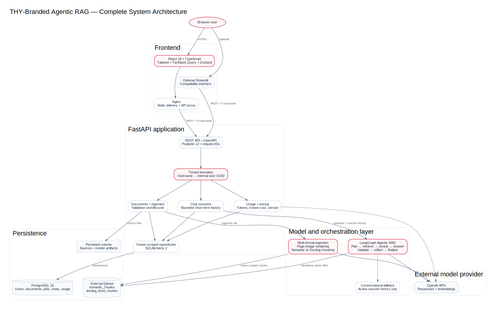
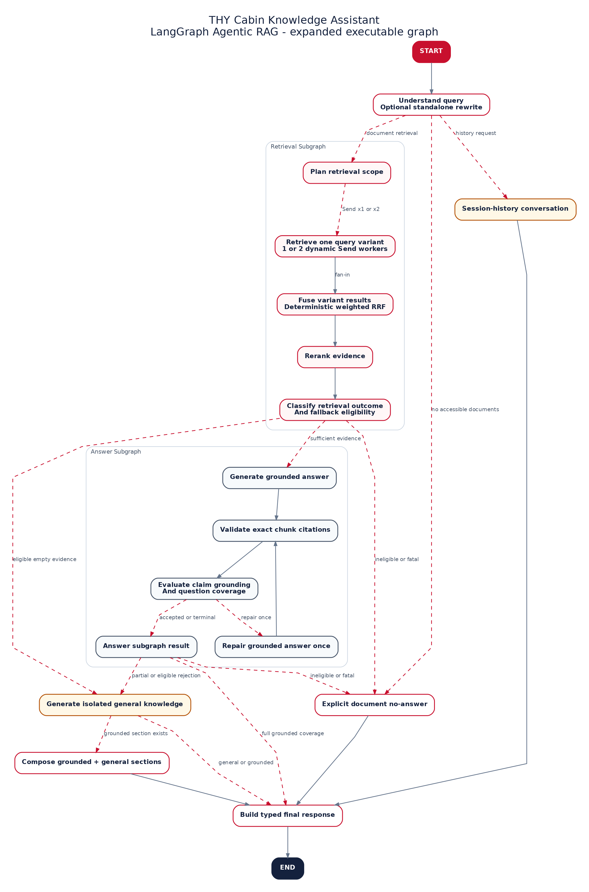

<p align="center">
  
</p>

<h1 align="center">Cabin Knowledge Assistant</h1>

<p align="center">
  <strong>A THY-branded, multi-user Agentic RAG proof of concept for private document intelligence.</strong>
</p>

<p align="center">
  
  
  
  
  
  
  
</p>

---

## Overview

Cabin Knowledge Assistant turns private PDF, DOCX, and PPTX files into a user-isolated knowledge base. It combines a professional React application, an asynchronous typed FastAPI boundary, async SQLAlchemy persistence, an external Qdrant cluster, OpenAI Responses and Embeddings APIs, Docling, and an asynchronous modular LangGraph workflow.

The system supports two ingestion strategies, bounded concurrent multi-document processing, five-way parallel query retrieval, deterministic cross-collection fusion, interactive source citations, polished KaTeX mathematics, session-scoped conversational memory, provider token accounting, versioned USD pricing, and retryable document deletion. React is the only frontend and runs as a focused three-panel document chat workspace.

> [!IMPORTANT]
> This repository is a proof of concept. Username-based identity demonstrates tenant scoping but is not authentication. Add enterprise identity, authorization, rate limiting, malware scanning, and durable background workers before production use.

## What the system delivers

| Capability | Implementation |
| --- | --- |
| Multi-format ingestion | Multiple PDF, DOCX, and PPTX uploads with backend validation and bounded asynchronous document/page processing |
| Two chunking paths | Variable-length semantic page chunks or Docling fixed token windows |
| Private retrieval | Mandatory backend-resolved `user_id` and completed-document filters on every Qdrant query |
| Agentic RAG | Exactly five faithful query variants, LangGraph `Send` map branches, parallel Qdrant retrieval, deterministic reduction, reranking, grounding, citation validation, and reflection |
| Conversational continuity | Citation-free fallback using only the active PostgreSQL chat session when useful document evidence is unavailable |
| Traceable answers | Inline citation previews on hover, focus, or tap plus expandable evidence cards with actual filename, location, excerpt, score, ingestion method, collection, and chunk metadata |
| Usage observability | Input, cached input, output, reasoning tokens, known USD cost, model snapshot, and pricing registry version |
| Safe deletion | Retryable PostgreSQL state, owner-filtered deletion from both Qdrant collections, then physical file removal |
| Async application stack | AsyncOpenAI, AsyncQdrantClient, SQLAlchemy AsyncSession, async FastAPI services, and non-blocking React request orchestration |
| Portable operation | Docker Compose for PostgreSQL, FastAPI, and React; external Qdrant remains environment-configured |

## Complete system architecture

<p align="center">
  
</p>

The browser never supplies an internal user identifier. FastAPI resolves the logical username, establishes the tenant boundary, and passes the internal UUID into owner-scoped repositories and Qdrant filters. Source files remain in a persistent volume, relational state remains in PostgreSQL, and document chunks remain in the configured external Qdrant instance.

The editable Graphviz source and rendered PNG are stored beside the SVG in [`docs/architecture`](docs/architecture).

## LangGraph Agentic RAG architecture

<p align="center">
  
</p>

The full-resolution, slide-ready image remains available separately as [`docs/architecture/langgraph-agentic-rag.png`](docs/architecture/langgraph-agentic-rag.png).

The committed PNG is generated from the executable graph rather than a separately maintained flowchart. [`generate_architecture_diagrams.py`](scripts/generate_architecture_diagrams.py) compiles `build_rag_graph()`, expands both compiled subgraphs through `get_graph(xray=True)`, verifies the node, edge, and conditional-edge sets, saves LangGraph's Mermaid representation, and renders the branded slide-ready PNG locally. Generation fails if the executable topology changes without corresponding labels and documentation; no graph definition or source content is sent to an external rendering service.

In this implementation, **agent** means the parent `thy_agentic_rag_graph`; **subagent** means one of its two compiled, typed subgraphs. The remaining named components are executable LangGraph nodes or conditional routing functions, not hidden autonomous agents.

| Architecture level | Component | Responsibility |
| --- | --- | --- |
| Parent agent | `thy_agentic_rag_graph` | Owns the turn lifecycle, conditional routing, conversational recovery, final typed response, and optional checkpoint integration. |
| Retrieval subagent | `retrieval_subgraph` | Plans collection scope, fans exactly five query variants into asynchronous map workers, deterministically reduces their results, and reranks the evidence. |
| Answer subagent | `answer_subgraph` | Produces an evidence-only draft, deterministically validates exact chunk citations, and performs structured claim-level grounding reflection. |

### Complete node and router catalog

| Scope | Executable component | What it does |
| --- | --- | --- |
| Parent | `START` | LangGraph entry boundary for a typed `RagState`. |
| Parent | `query_understanding` | Normalizes the question, classifies coarse intent, resolves referential follow-ups from bounded active-session history, and builds exactly five distinct variants: verbatim, standalone, English, keyword-focused, and source-style. The optional query-rewriter adapter is used when documents are available; a deterministic fallback preserves the five-variant contract. |
| Parent router | `route_after_query_understanding` | Sends explicit conversation-history requests or users with no retrievable documents directly to conversational generation; all other turns enter the retrieval subgraph. |
| Retrieval | `retrieval_planner` | Selects semantic chunks, Docling fixed chunks, or both from the explicit collection scope and records top-k, rerank, and hybrid-scoring settings in a typed `RetrievalPlan`. |
| Retrieval router | `dispatch_query_variants` | Emits one LangGraph `Send` task per typed query variant. It is an edge function, so the diagram represents it as the conditional `Send x5` transition rather than an extra node box. |
| Retrieval | `retrieve_variant` | Runs once for each of the five dynamic map tasks. Each worker asynchronously embeds its variant and queries all selected Qdrant collections concurrently with mandatory owner and completed-document filters. Branch failures are captured as typed node errors instead of corrupting successful branches. |
| Retrieval | `fuse_variant_results` | Fans results back in, deduplicates them, preserves the strongest raw provider score, and applies deterministic weighted reciprocal-rank fusion. The state reducer is associative, commutative, and idempotent, so provider completion order cannot change the business ordering. |
| Retrieval | `reranking` | Reranks fused candidates while retaining citation metadata and calculates whether the raw evidence score satisfies the configured answer threshold. It safely retains the fused ranking if the replaceable reranker fails. |
| Parent router | `route_after_retrieval` | Sends sufficient evidence into the answer subgraph; empty or below-threshold evidence is prohibited from entering grounded generation and moves to citation-free conversational recovery. |
| Answer | `answer_generation` | Gives the answer model only the selected evidence and requires exact internal chunk-ID markers. If evidence is below threshold or generation fails, it sets the grounded path to no-answer. Active-session history can clarify the question but is explicitly not document evidence. |
| Answer | `citation_validation` | Deterministically extracts exact chunk markers and rejects missing valid citations, unknown IDs, cross-user IDs, and chunks below the citation threshold. Only explicitly cited, owner-matching evidence becomes public citation metadata. |
| Answer | `claim_evidence_reflection` | Uses the structured grounding evaluator to check each claim against the cited full chunk text. Unsupported claims, missing citations, high hallucination risk, invalid evaluator IDs, or evaluator failure all fail closed. |
| Parent router | `route_after_answer` | Accepts only a non-no-answer draft with valid citations and grounded reflection. A rejected draft loses document citations and moves to conversational recovery. |
| Parent | `conversation_generation` | Produces a citation-free response using only bounded history from the active chat. It handles chat-history questions and safely recovers from absent, insufficient, or rejected document evidence without presenting session text as document truth. Empty or failed fallback generation becomes an explicit no-answer. |
| Parent | `final_response` | Builds the typed `RagResponse`. Accepted grounded answers receive compact public citation markers; conversational answers have no citations; unsafe or empty results return the explicit no-answer response. |
| Parent | `END` | LangGraph terminal boundary after the typed response is available. |

### Grounding, ownership, and extension invariants

- **Ownership is enforced before generation.** The backend resolves the current user, passes only that user's completed document IDs into `RagSettings`, and the Qdrant adapter applies both `user_id` and allowed-document filters to every dense and sparse prefetch. Retrieved payloads are checked again before chunks can reach reranking or prompts.
- **Grounded generation is evidence-only.** Retrieved chunks are the only factual document context. Conversation history is role-preserving, session-scoped clarification context and is never treated or cited as source evidence.
- **Insufficient evidence cannot become a grounded answer.** It bypasses the answer subgraph. Conversational recovery may answer only from active-session context and never fabricates document claims or citations; if it cannot produce a safe response, `final_response` emits the explicit no-answer result.
- **Citation validation and reflection are first-class stages.** Deterministic chunk-ID and ownership checks run before the structured claim-evidence evaluator, and both must pass before a grounded response is released.
- **Nodes are replaceable and extensible.** `RagNodeSet` binds graph nodes to protocol-based `RagAdapters`, so query rewriting, embeddings, retrieval, reranking, answer generation, and grounding evaluation can be replaced independently without changing the public runner or typed graph contract. New routing branches remain explicit in `graphs.py` and will force diagram regeneration checks to be updated.
- **Concurrency is bounded by graph semantics.** LangGraph schedules the five `Send` workers independently; each worker awaits one embedding and concurrently searches the selected collections. Typed reducers provide a deterministic fan-in before reranking and generation.

### Async design provenance

The implementation applies four LangGraph patterns that were analyzed from local reference exports during development without adding those HTML exports to the public repository:

- **Parallelization:** explicit fan-out/fan-in barriers and deterministic business ordering instead of relying on completion order.
- **Subgraphs:** typed retrieval and answer subgraphs with clear input/state/output contracts.
- **Map-reduce:** dynamic `Send` workers and an associative, commutative, idempotent result reducer.
- **Research assistant:** nested asynchronous orchestration that separates query generation, source retrieval, evidence synthesis, and final response construction.

These patterns keep provider I/O concurrent while preserving reproducible answers and owner-isolation invariants.

## Repository layout

```text
.
├── backend/
│   ├── alembic/                 # PostgreSQL migrations
│   ├── app/                     # FastAPI routes, services, repositories, and schemas
│   └── Dockerfile
├── config/
│   ├── model-capabilities.v1.json
│   └── pricing/openai-pricing.v1.json
├── docs/architecture/           # Generated architecture images and editable sources
├── frontend/                    # React 19, Vite, TypeScript, and Nginx application
├── model/
│   ├── agentic_rag/             # LangGraph graph, nodes, adapters, runner, and contracts
│   ├── document_processing/     # PDF and Office rendering plus Docling processing
│   ├── ingestion/               # Connected ingestion coordinator
│   ├── semantic_chunking/       # Flat, page-independent semantic chunking
│   └── vector_store/            # Qdrant persistence, sparse vectors, and retrieval
├── scripts/
│   └── generate_architecture_diagrams.py
├── .env.example                 # Safe public configuration template
├── alembic.ini
├── docker-compose.yml
└── requirements.txt
```

Local tests, source documents, notebooks, generated page images, QA captures, private planning notes, credentials, dependency folders, and build output are intentionally outside the public Git surface.

## Core data flows

### Semantic ingestion

1. FastAPI validates the upload and stores its source file under internal user and document identifiers.
2. PDF pages render directly to images. DOCX and PPTX files convert through LibreOffice before every page or slide renders to an image.
3. Each page is analyzed independently with AsyncOpenAI and the selected Responses model/reasoning effort. Bounded page batches limit concurrent semantic analysis calls through `SEMANTIC_PAGE_MAX_CONCURRENCY`.
4. No previous-page summary, dictionary memory, continuation context, or earlier page image is added to the semantic prompt.
5. Strict Pydantic output produces a flat list of variable-length semantic chunks; recursive and nested chunk structures are rejected.
6. The authoritative chunk text is embedded and stored unchanged in `semantic_chunks`.
7. Embeddings and Qdrant upserts are awaited through AsyncOpenAI and AsyncQdrantClient in bounded batches controlled by `SEMANTIC_FLUSH_BATCH_SIZE`.
8. A retry first removes only the same backend-resolved `user_id` and `document_id` points from the target collection and fails closed if cleanup is unsuccessful.
9. Document-first row locks and a PostgreSQL partial unique index enforce one active ingestion job per document and exclude deletion while a job is pending or processing.
10. Multiple selected documents run concurrently within `INGESTION_JOB_CONCURRENCY`; model-level discovery runs document batches bounded by `DOCUMENT_MAX_CONCURRENCY`.

### Docling fixed ingestion

Docling extracts supported documents through a thread-offloaded blocking boundary, applies the configured token window and overlap, asynchronously embeds the chunks, and writes only to `docling_fixed_chunks`. LibreOffice conversion uses a cancellable asynchronous subprocess. Semantic model and reasoning controls do not apply to this path.

### Chat and retrieval

1. A per-session async turn lock preserves message order within one chat while different chat sessions continue concurrently.
2. PostgreSQL loads only the selected session's bounded message history and releases its read transaction before provider I/O.
3. The graph normalizes the question and produces exactly five distinct, faithful searchable text variations.
4. LangGraph dispatches five `Send` workers. Each worker asynchronously embeds its query and searches Qdrant independently; selected collections are also queried concurrently.
5. Every Qdrant call applies mandatory backend-resolved owner and completed-document filters.
6. An idempotent reducer compares and deduplicates candidates across all variants, then applies deterministic weighted reciprocal-rank fusion while preserving raw retrieval scores for evidence thresholds.
7. The fused candidates are reranked and only above-threshold evidence is injected into the answer prompt.
8. Grounded answers receive citations only for chunks actually cited by exact chunk ID.
9. If useful evidence is unavailable, the same chat remains usable through normal conversational generation without fabricated citations.
10. Messages persist through async SQLAlchemy transactions; chat messages are never written to Qdrant.

## Persistence model

| Table | Responsibility |
| --- | --- |
| `users` | Unique normalized username and timestamps |
| `documents` | Owner, hash, source path, MIME type, ingestion configuration, collection, and lifecycle state |
| `ingestion_jobs` | Pending/processing/completed/failed status, counts, timing, failure details, usage, and known cost |
| `chat_sessions` | Owner, LangGraph-compatible session identifier, title, and activity timestamps |
| `chat_messages` | Session-scoped user and assistant content, citations, actual model, and reasoning effort |
| `usage_records` | Operation stage, provider, model, token categories, USD cost, pricing version, and pricing status |

## API surface

| Method | Route | Purpose |
| --- | --- | --- |
| `GET` | `/health` | Process liveness |
| `GET` | `/ready` | PostgreSQL, Qdrant, and OpenAI readiness |
| `POST` | `/api/v1/users/resolve` | Resolve or create a logical username |
| `GET` | `/api/v1/models` | Return runtime-accessible configured models |
| `GET` | `/api/v1/documents` | List the current user's documents |
| `POST` | `/api/v1/documents/upload` | Validate and store multiple source files |
| `DELETE` | `/api/v1/documents/{document_id}` | Run owner-scoped, retryable deletion |
| `POST` | `/api/v1/ingestion-jobs` | Start ingestion for uploaded documents |
| `POST` | `/api/v1/ingestion-jobs/status` | Poll multiple owner-scoped jobs in one request |
| `GET` | `/api/v1/ingestion-jobs/{job_id}` | Poll one owner-scoped job |
| `GET` | `/api/v1/chat/sessions` | List the current user's chats |
| `POST` | `/api/v1/chat/sessions` | Create a clean short-term memory context |
| `GET` | `/api/v1/chat/sessions/{session_id}/messages` | Load one session's messages |
| `POST` | `/api/v1/chat/sessions/{session_id}/messages` | Run chat with independent model settings |
| `GET` | `/api/v1/usage` | Return request, session, workspace, and stage totals |

Interactive OpenAPI documentation is available at `http://localhost:8000/docs` while the backend is running.

## Quick start with Docker Compose

### Prerequisites

- Docker Engine or Docker Desktop with Compose
- An OpenAI API key
- A reachable external Qdrant cluster and API key

### Start

```bash
git clone https://github.com/<account>/<repository>.git
cd <repository>
cp .env.example .env
```

Edit `.env` and replace the OpenAI and Qdrant placeholders. For any shared environment, also replace the local PostgreSQL password and keep the two database URLs consistent.

```bash
docker compose up --build
```

| Surface | URL |
| --- | --- |
| React application | `http://localhost:3000` |
| FastAPI | `http://localhost:8000` |
| OpenAPI | `http://localhost:8000/docs` |

Stop containers without deleting persistent data:

```bash
docker compose down
```

> [!CAUTION]
> `docker compose down --volumes` permanently removes the Compose-managed PostgreSQL and document-processing volumes.

## Local development on Linux and macOS

The repository pins Python 3.12 and Node.js 22 through `.python-version`, `.node-version`, and `.nvmrc`.

### System packages

Linux:

```bash
sudo apt-get update
sudo apt-get install -y build-essential pkg-config libreoffice-writer libreoffice-impress graphviz libgraphviz-dev fontconfig fonts-dejavu-core fonts-liberation2
```

macOS:

```bash
brew install graphviz
brew install --cask libreoffice
```

If LibreOffice is not on `PATH` on macOS, add this to `.env`:

```dotenv
SOFFICE_BINARY=/Applications/LibreOffice.app/Contents/MacOS/soffice
```

### Install application dependencies

```bash
python3.12 -m venv .venv
source .venv/bin/activate
python -m pip install --upgrade pip
python -m pip install -r requirements.txt
cp .env.example .env
```

```bash
cd frontend
nvm use
npm ci
cd ..
```

### Start PostgreSQL and migrate

Do not run local Uvicorn while the Compose backend still owns port `8000`. Preserve the database while switching modes with:

```bash
docker compose stop frontend backend
docker compose up -d postgres
docker compose exec -T postgres pg_isready -U thy_app -d thy_case_study
python -m alembic -c alembic.ini upgrade head
```

### Terminal 1 — FastAPI

```bash
source .venv/bin/activate
python -m uvicorn backend.app.main:app --host 127.0.0.1 --port 8000 --reload
```

### Terminal 2 — React

```bash
cd frontend
nvm use
npm run dev
```

Open `http://127.0.0.1:5173`. Vite proxies `/api`, `/health`, and `/ready` to FastAPI.

## Environment configuration

`.env.example` is the only public environment template. `.env` and every other environment override are ignored.

The minimum connected configuration is:

```dotenv
OPENAI_API_KEY=replace-with-openai-api-key
QDRANT_URL=https://your-qdrant-cluster.example
QDRANT_API_KEY=replace-with-qdrant-api-key
POSTGRES_PASSWORD=local-dev-password
```

| Group | Important variables |
| --- | --- |
| Application | `APP_ENV`, `LOG_LEVEL`, `API_PORT`, `FRONTEND_PORT`, `CORS_ALLOWED_ORIGINS` |
| PostgreSQL | `POSTGRES_DB`, `POSTGRES_USER`, `POSTGRES_PASSWORD`, `DATABASE_URL`, `DATABASE_INTERNAL_URL` |
| File processing | `UPLOAD_DIR`, `PAGE_IMAGE_DIR`, `PROCESSING_DIR`, `MAX_UPLOAD_SIZE_MB`, `DOC_CONVERSION_DPI`, `SOFFICE_BINARY` |
| External Qdrant | `QDRANT_URL`, `QDRANT_API_KEY`, collection names, named vectors, and dense vector size |
| OpenAI | `OPENAI_API_KEY`, `OPENAI_BASE_URL`, model cache duration, embedding model, and request timeout |
| Ingestion | `INGESTION_JOB_CONCURRENCY`, `DOCUMENT_MAX_CONCURRENCY`, `SEMANTIC_PAGE_MAX_CONCURRENCY`, semantic flush size, embedding batch size, fixed chunk size, and fixed overlap |
| Retrieval | Top-k values, hybrid weights, reranker, score thresholds, and session history limit |
| Registries | `MODEL_CAPABILITIES_PATH`, `PRICING_REGISTRY_PATH` |

Qdrant is intentionally not created by Compose. `QDRANT_URL` must be reachable from the backend container. A cloud HTTPS endpoint works directly; a Qdrant process on the Docker host can use `http://host.docker.internal:<port>`.

### Concurrency controls

The defaults favor predictable local-resource use and can be tuned independently:

| Variable | Default | Boundary |
| --- | ---: | --- |
| `INGESTION_JOB_CONCURRENCY` | `4` | Maximum backend ingestion jobs executing simultaneously in one process; at the default, four selected files can run concurrently |
| `DOCUMENT_MAX_CONCURRENCY` | `2` | Maximum discovered documents processed concurrently inside a model ingestion run |
| `SEMANTIC_PAGE_MAX_CONCURRENCY` | `3` | Maximum page-image analysis requests in flight for one semantic document |
| `SEMANTIC_FLUSH_BATCH_SIZE` | `32` | Maximum flat chunks accumulated before awaited embedding/upsert flush |

These are bounded application-level limits, not global distributed quotas. When multiple backend replicas are deployed, use a durable queue and shared rate-limit coordination.

## Model access and pricing

`config/model-capabilities.v1.json` contains configured chat and semantic model candidates plus supported reasoning efforts. FastAPI intersects that list with the models visible to the configured OpenAI project. An unavailable model is displayed as unavailable and cannot be silently selected or substituted.

Semantic chunking and answer generation use independent model and reasoning settings.

`config/pricing/openai-pricing.v1.json` is the versioned pricing registry. Every calculated usage record retains the actual provider model and pricing version. Unknown prices remain explicitly unpriced; the application never invents token counts or cost.

## Regenerate the architecture images

The committed images are ready for GitHub display. To regenerate them after changing the graph or system design, install the optional local documentation dependency:

```bash
source .venv/bin/activate
python -m pip install -r requirements-architecture.txt
python scripts/generate_architecture_diagrams.py
```

Linux requires the compiler toolchain, `pkg-config`, and `libgraphviz-dev` shown above; macOS uses the Graphviz installation shown above. Generated assets:

- `docs/architecture/langgraph-agentic-rag.mmd`
- `docs/architecture/langgraph-agentic-rag.png`
- `docs/architecture/complete-system-architecture.dot`
- `docs/architecture/complete-system-architecture.svg`
- `docs/architecture/complete-system-architecture.png`

## Public repository boundary

The ignore rules are deliberately conservative:

- no `.env`, API key, credential override, or editor secret;
- no test source code;
- no uploaded sample or personal document;
- no notebook output or experimental credential check;
- no generated page image, processing artifact, database, coverage, dependency folder, or compiled frontend;
- no internal QA screenshot, delivery plan, or agent workspace metadata.

Before the first push, inspect the exact staged surface:

```bash
git init
git add .
git status --short
git diff --cached --check
git grep --cached -l -E 'BEGIN (RSA |EC |OPENSSH )?PRIVATE KEY|sk-[A-Za-z0-9_-]{20,}' || true
```

The last command reports filenames only. Investigate any result and remove the staged secret before committing.

Then publish to the repository you control:

```bash
git commit -m "Publish THY-branded Agentic RAG proof of concept"
git branch -M main
git remote add origin https://github.com/<account>/<repository>.git
git push -u origin main
```

No GitHub remote is configured or pushed automatically by this project.

## Operational validation

The following checks do not require connected OpenAI or Qdrant requests:

```bash
python -m compileall -q backend model scripts
docker compose config --quiet
```

```bash
cd frontend
npm test
npm run lint
npm run build
```

Connected ingestion and chat operations can incur provider charges.

## Proof-of-concept limitations

- Username identity is not password authentication, SSO, or an authorization protocol.
- FastAPI schedules ingestion as awaited async background coroutines, but in-process background tasks are not a durable distributed queue and do not survive a worker restart.
- Chat execution is asynchronous internally and browser timeouts abort fetches, but HTTP responses are non-streaming; durable request idempotency and provider-side cancellation after a client disconnect are not yet guaranteed.
- PostgreSQL reconstructs session context instead of using a distributed LangGraph checkpointer.
- Concurrency limits are process-local; multiple backend replicas require shared queue and rate-limit coordination.
- Existing Qdrant points are not automatically migrated when a chunk schema changes; reingest those documents.
- Rendering artifacts require a production retention and cleanup policy.
- DOCX pagination can vary when host fonts differ; the backend image installs repeatable DejaVu and Liberation fonts.
- Clickable source previews, malware scanning, audit export, OCR prewarming, and production rate limiting remain outside this POC.

## Brand and licensing notice

This is an independent technical proof of concept and is not an official Turkish Airlines product. Turkish Airlines and THY names, marks, and logo remain the property of their respective owner. No open-source license is included; select and add an appropriate license before granting reuse or contribution rights.
